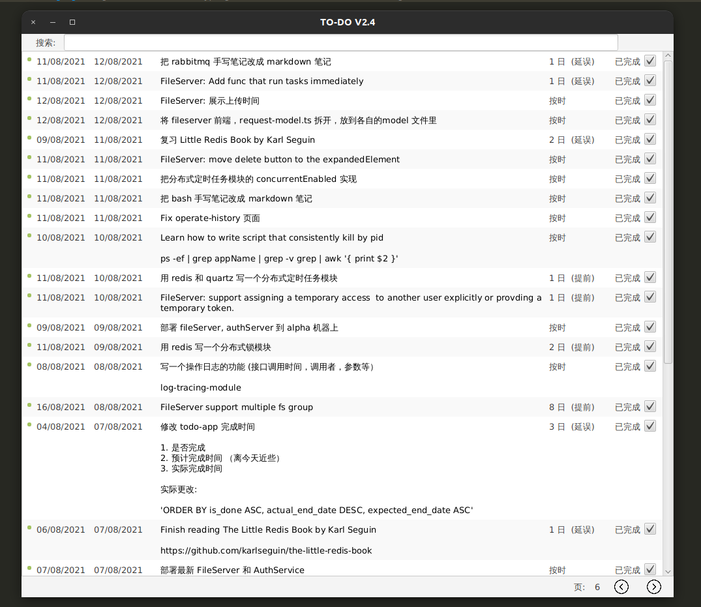
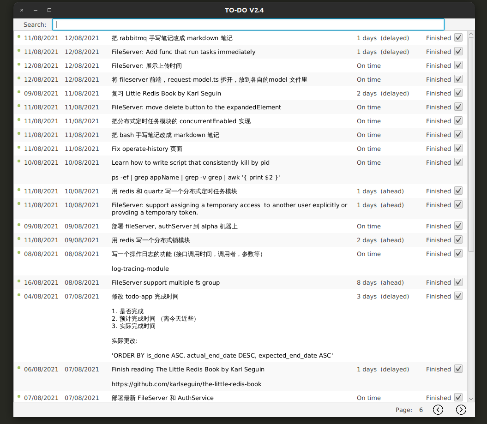

# Todo-App

JavaFX app for managing TO-DOs. Supports both Windows and Linux platforms. Download it in RELEASE.

## Pre-requisite

- Oracle JDK-8 
    - (For Openjdk or jdk > 1.8, uncomment the dependencies in pom.xml)

## Configuration
- **Configuration via UI or external configuration file**
    - `$HOME/todo-app/settings.json`
- **Persistence** using **SQLite**.
    - `$HOME/todo-app/todoapp.db`

Note: These external configuration files are created at home.user directory under the folder named `/todo-app`. If you are using Linux, it will be under `/home/somebody/` directory. If you are using Windows, it will be at your `...\users\yourName\` directory.

### Example of settings.json

`"language"` only supports `"chn"` (for Chinese) or `"eng"` (for English, which is the default language).

```
E.g.,

{
    "savePath": "/home/zhuangyongj/save.json",
    "language": "eng",
    "strikethroughEffectEnabled":false
    ...
}
```
## Demo



